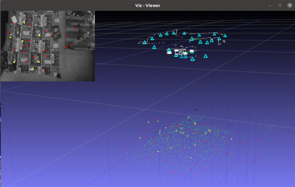

# Hybrid VSLAM

Ros 2 implementation of the visual-based SLAM approach described in the paper:

R Munguia, JC Trujillo, E Guerra, A Grau "A Hybrid Visual-Based SLAM Architecture: Local Filter-Based SLAM with KeyFrame-Based Global Mapping" Sensors 22 (1), 210. https://doi.org/10.3390/s22010210



The Hybrid VSLAM is composed of the following ROS 2 components and nodes (See https://docs.ros.org/en/galactic/Concepts/About-Composition.html):

*IMPORTANT: Note that this software is under development.*  

**ROS 2 components:** 

-  **Local SLAM** (*Implemented*). The local SLAM component implements a filter-based visual-based SLAM system with state vector-size bounded to maintain real-time operation. By itself, this component produces up-to metric scale (world referenced) estimates of both, the robot state, and a local map of features. But in this case, since old features are removed from the vector state, to maintain real-time operation, previously visited areas of the environment can not be recognized, and thus the accumulated position drift can not be corrected by the same process alone.
- **Global SLAM** (*Partially implemented*). The Global SLAM component takes as input  Key-frames produced by the local SLAM process to create and maintain a global and persistent map of the environment as well as correct the accumulated drift when loops are detected. This component makes use of optimization-based techniques such as bundle adjustment and graph-based SLAM.
- **Plot** (*Implemented*). The plot component implements a 3d scene of the robot's pose and trajectory as well as a map of visual features.
- **Dataset** (*Implemented*). This component emulates an actual robot driver by reading the dataset files and publishing the robot sensor data to ROS topics.

**ROS 2 nodes:**

- **Keyboard** (*Implemented*). Implements a simple command-line interface to interact with the Hybrid VSLAM application.


**Dependencies** (Tested in: Ubuntu 20.04)**:**

1.- ROS 2 (Galactic)

2.- Armadillo C++ library (tested with version 11.0.1), http://arma.sourceforge.net/ .
    Armadillo requires BLAS/OPENBLAS and LAPACK libraries installed 

3.- OpenCV with extra modules installed (opencv_contrib) (tested with OpenCV version 4.2.0), https://opencv.org/ 
    The following OpenCV contrib modules are also required or recommended:
    - VIZ (Required). VIZ requires VTK support (tested with version 8.1.0).
    - SFM (Recommended). For SFM dependencies check: https://docs.opencv.org/4.x/db/db8/tutorial_sfm_installation.html Note. For compilling OpenCV with SFM, Ceres solver library http://ceres-solver.org/ version < 2.0 is required (tested with 1.14). 

4.- GTSAM c++ library (tested with version 4.1.1) https://gtsam.org/

**Usage:**

1.- Use colcon for compiling the project  (in the root project folder):  
```
foo@bar:~/home/Hybrid_VLSAM$ colcon build
```
2.- Extract the sample dataset included in folder /Dataset_sample:
```
foo@bar:~/home/Hybrid_VLSAM/Dataset_sample$ tar -xf 2022-1-22-16-6.tar.xz
 ```
 3.- In a text editor open the file "params.yaml" located in the folder "config", and set the parameter "Dataset_path:" with the absolute path of the extracted dataset folder. Example:
 ```
 Dataset_path: /home/Hybrid_VLSAM/Dataset_sample/2022-1-22-16-6/
``` 
4.-  In the root project folder open a terminal and source the overlay:
```
foo@bar:~/home/Hybrid_VLSAM$ . install/setup.bash
```
5.- In the same terminal run the Hybrid SLAM using the launch file "launch/slam.launch.py". At this point, a graphical interface must be opened.
```
foo@bar:~/home/Hybrid_VLSAM$ ros2 launch launch/slam.launch.py
```
6.- In the root project folder open a second terminal and source the overlay: 
```
foo@bar:~/home/Hybrid_VLSAM$ . install/setup.bash
```
7.- Run the keyboard interface node:
```
foo@bar:~/home/Hybrid_VLSAM$ ros2 run keyboard keyboard_node
```
At this point, the following menu must appear in the console:
```
| Dataset commands :
|   'q' to quit.
|   'p'-> Play/Pause  r-> Reset
|   '-'-> zoom out '+' ->  zoom in '1'-> x-y view '2' -> x-z view  '3'->y-z view
|   '8'-> view up '5' ->  view down '4'-> view left '6' -> view right  'c'-> clear plot
```
8.- Press the key "p".

*Notes on the sample dataset:* The sample dataset was captured in a very small environment and therefore can be easily mapped using only the local slam component. On the other hand, to test the global mapping component the maximum number of local visual features has been limited to allow the local slam to present error drift. In this latter case, the global mapping component minimizes the drift by using the bundle adjustment technique.
You can change the number of the local map features allowed by changing parameters: Visual_delete_Maximun_number_XX in the configuration file /config/params.yaml. Or you can for instance deactivate the global mapping pose correction by setting false parameters BA_update_kf_XXX to observe the local slam drift.